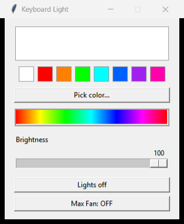

# Aero Keyboard Light + Max Fan

A tiny, no-bloat tray app for **Gigabyte AERO / AORUS** laptops:

- **Keyboard RGB** — set the per-key backlight color and brightness (the
  keyboard is a standard HID LampArray device).
- **One-button Max Fan** — slam the fans to full for gaming, one click to put
  them back. No Gigabyte Control Center / GiMATE required at all.

It's a ~400-line Python script frozen into a single `KeyboardLight.exe`. No
service, no background bloat — just a tray icon.

<p align="center"></p>

> **Why this exists:** Gigabyte's own software (GiMATE / GIGABYTE Control
> Center) is heavy, and on some machines the fan-control UI is hidden behind a
> capability gate that never shows up. This app talks to the same firmware
> directly, so you get a max-fan button without any of that.

## Install

1. Download `KeyboardLight.exe` from [Releases](../../releases).
2. Double-click it → **Install?** → **Yes** → approve the one UAC prompt.

That's it. It installs to `%LOCALAPPDATA%\KeyboardLight`, starts at login, and
adds a Start-menu entry. Click **Max Fan** in the window (or the tray) to
toggle full fans.

To remove: run `KeyboardLight.exe --uninstall` (or from the install folder).

## Requirements / scope

- **Gigabyte AERO / AORUS laptop.** The RGB uses USB `0414:8104`; the fan
  control uses Gigabyte's ACPI-WMI interface. On other brands the app runs but
  the keyboard/fan features won't do anything.
- Windows 10/11.
- The exe is unsigned, so SmartScreen may warn on first run (**More info →
  Run anyway**). Antivirus sometimes flags PyInstaller one-file exes; build
  from source if you'd rather.

Max fan is **safe** — it only ever asks for *more* cooling, never less, and the
firmware still enforces its own thermal limits.

## How the Max Fan button works

This was reverse-engineered from GiMATE. The short version:

- Gigabyte's "Turbo" fan mode doesn't poke the Embedded Controller directly —
  it calls **ACPI-WMI** methods on the `root\WMI` class **`GB_WMIACPI_Set`**.
  These are implemented in the laptop's BIOS firmware.
- "Max fan" is this sequence of calls:

  | Method | Value | Effect |
  |---|---|---|
  | `SetCurrentFanStep` | 0 | clear step index |
  | `SetAutoFanStatus` | 0 | disable the auto/dynamic governor |
  | `SetFixedFanSpeed` | 100 | CPU-side fans to full duty |
  | `SetGPUFanDuty` | 100 | GPU-side fans to full duty |
  | `SetStepFanStatus` | 1 | enable manual/fixed mode |
  | `SetFixedFanStatus` | 1 | lock the fixed duty in |

  "Normal" releases the fixed lock and hands control back to the firmware curve.

- The `GB_WMIACPI_Set` class only appears once a **MOF** is registered. Instead
  of shipping Gigabyte's proprietary `acpimof.dll`, this repo includes a
  **clean-room [`aero_fan.mof`](aero_fan.mof)** — a hand-written declaration of
  just the six fan methods, keyed to the BIOS's own WMI GUID
  (`{ABBC0F75-8EA1-11d1-00A0-C90629100000}`). No vendor binaries are
  redistributed. The installer compiles it once with `mofcomp`; it then persists
  in the WMI repository across reboots, independent of any Gigabyte software.

- The WMI setters require admin. To avoid a UAC prompt on every click (and any
  console flash), the app registers two elevated, on-demand scheduled tasks
  (`AeroFanMax`, `AeroFanNormal`) that run the windowed exe in `--fan` mode, and
  triggers them with `schtasks /run`.

Full teardown of the reversing is in the commit history / code comments.

## Build from source

```powershell
pip install hid pystray pillow wmi pywin32 pyinstaller
./build.ps1        # -> dist\KeyboardLight.exe
```

Run from source (no exe): `pythonw keyboard_light.pyw`, and once, elevated,
`./setup_fan_task.ps1` to register the fan class + tasks.

## Credit

Created by **Elliott** ([@ejempty](https://github.com/ejempty)) — reverse
engineering, clean-room MOF, and app.

## License

[MIT](LICENSE) © 2026 Elliott (@ejempty).

Not affiliated with or endorsed by GIGABYTE. "AERO", "AORUS", and "GIGABYTE"
are trademarks of GIGA-BYTE Technology Co., Ltd.
